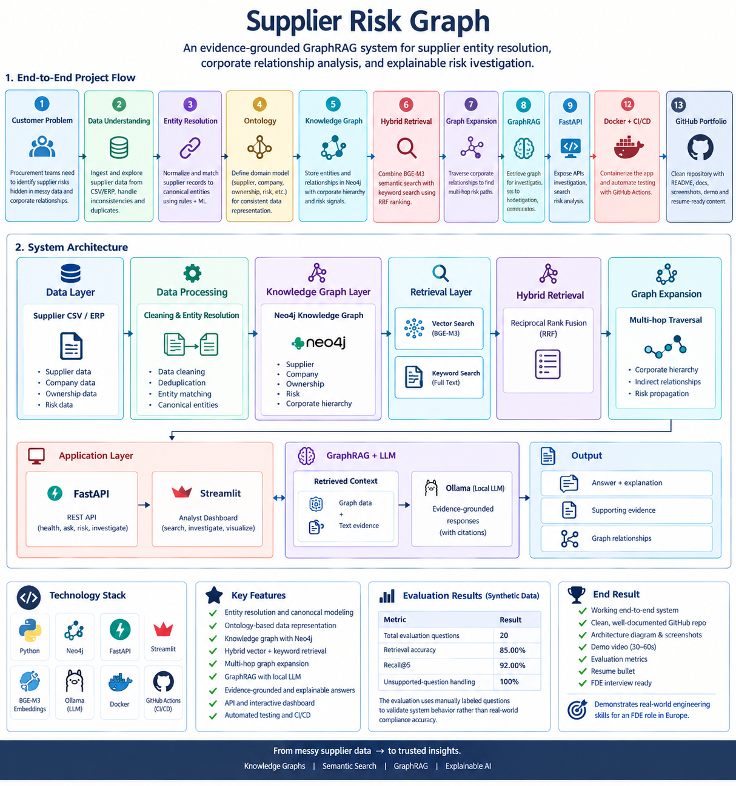
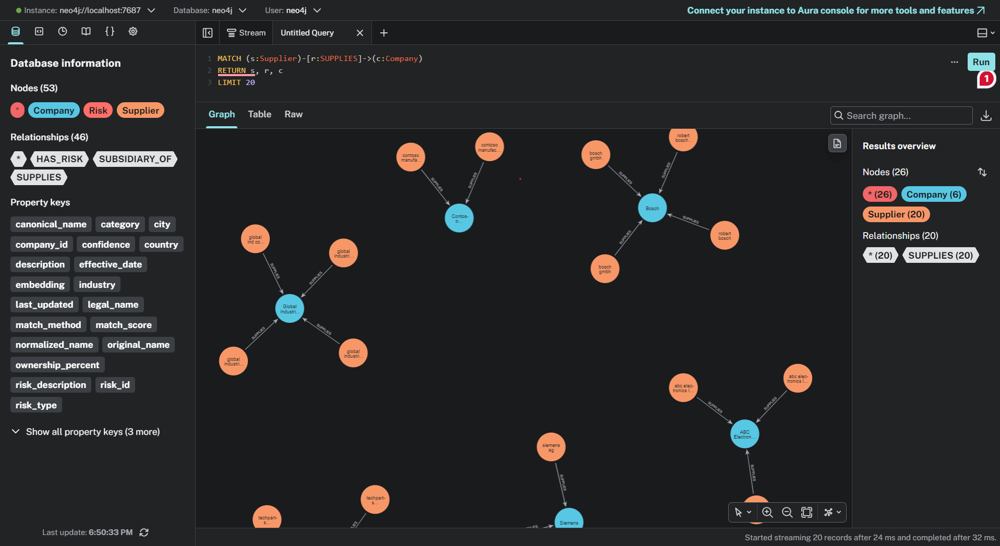
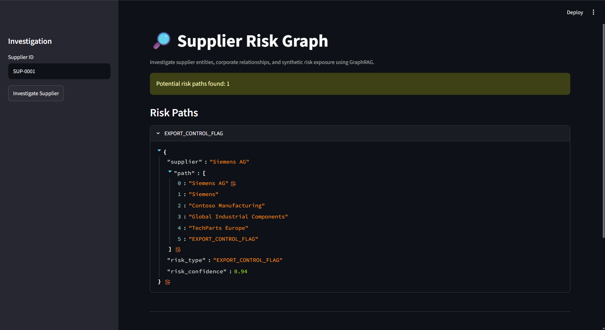
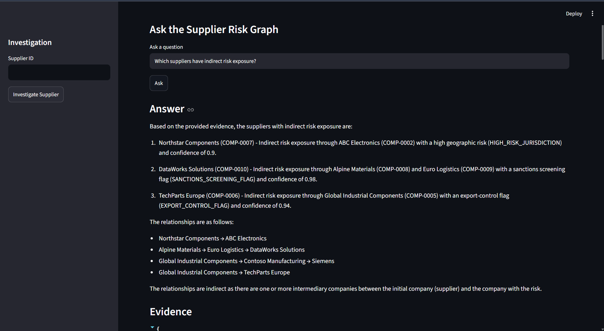
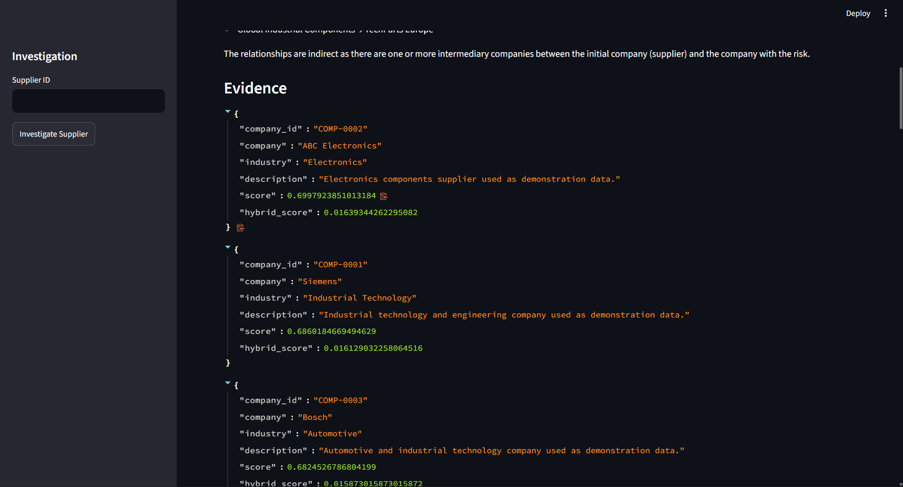
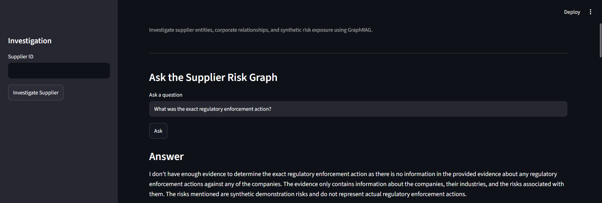

# Supplier Risk Graph

> An evidence-grounded GraphRAG system for supplier entity resolution, corporate relationship analysis, and explainable risk investigation.

[Overview](#overview) · [Architecture](#architecture) · [How It Works](#how-it-works) · [Evaluation](#evaluation) · [Local Setup](#local-setup) · [API](#api) · [Limitations](#limitations) · [License](#-copyright--licensing)

---

## Overview

### The problem

Procurement teams receive supplier data from ERP systems with inconsistent names, duplicate records, and incomplete company information. A simple name search cannot reliably surface **indirect risk exposure** that sits behind corporate relationships such as subsidiaries and parent companies.

### The solution

Supplier Risk Graph turns messy supplier records into a connected knowledge graph and uses it to answer risk questions with traceable evidence. It combines:

- Entity resolution and ontology-based modeling
- A Neo4j knowledge graph of companies, ownership, and risk signals
- Hybrid retrieval (vector + keyword search, fused with RRF)
- Multi-hop graph expansion
- GraphRAG with a local LLM that answers only from retrieved evidence

### Example use case

**Anna** is a procurement compliance analyst at a 2,000-person German manufacturer. She needs to investigate supplier risk without manually following corporate relationships across multiple systems.

```
Supplier record → Canonical entity → Corporate hierarchy → Risk relationship → Evidence retrieval → Grounded explanation
```

---

## Architecture



---

## Demo

### Knowledge graph


### Supplier investigation


### Evidence-grounded answer



### Unsupported question


## How It Works

| Step | Stage | Description |
|:---:|---|---|
| 1 | **Resolve** | Messy supplier records are cleaned, deduplicated, and matched to canonical company entities. |
| 2 | **Model** | Suppliers, companies, ownership relationships, and risk signals are represented as a knowledge graph in Neo4j. |
| 3 | **Retrieve** | Semantic vector search (BGE-M3) and keyword search are combined using Reciprocal Rank Fusion (RRF). |
| 4 | **Expand** | Retrieved companies are expanded through corporate relationships to find indirect, multi-hop risk paths. |
| 5 | **Reason** | A local LLM receives only the retrieved evidence and graph context. |
| 6 | **Explain** | The system returns an answer with supporting evidence and the graph relationships behind it. |
| 7 | **Refuse** | If the evidence does not support an answer, the system states that there is insufficient evidence. |

---

## Why GraphRAG?

Vector search can find relevant company descriptions, but it does not explicitly represent multi-hop relationships such as:

```
Supplier → Company → Subsidiary → Parent → Risk
```

The knowledge graph makes these relationships explicit. Hybrid retrieval identifies the relevant entities, graph expansion follows the relationships needed to understand indirect exposure, and the LLM explains the result from retrieved evidence rather than from its internal knowledge alone.

---

## Technology Stack

| Layer | Technology |
|---|---|
| Language | Python |
| Graph database | Neo4j |
| Embeddings | BGE-M3 via Sentence Transformers |
| Local LLM | Ollama |
| API | FastAPI |
| Dashboard | Streamlit |
| Containerization | Docker |
| Testing & CI/CD | Pytest, GitHub Actions |

---

## Evaluation

The system is evaluated on manually labeled questions covering retrieval, risk identification, corporate hierarchy traversal, and unsupported questions.

| Metric | Result |
|---|---:|
| Evaluation questions | 20 |
| Retrieval accuracy | 85.00% |
| Recall@5 | 92.00% |
| Unsupported-question handling | 100% |

> The evaluation dataset is synthetic and validates system behavior, not real-world compliance accuracy.

---

## Local Setup

**Prerequisites:** Python, Docker, and [Ollama](https://ollama.com).

```bash
# 1. Clone the repository
git clone <your-repository>
cd supplier-risk-graph

# 2. Create and activate a virtual environment
python -m venv .venv
source .venv/bin/activate        # Windows: .venv\Scripts\activate

# 3. Install dependencies
pip install -r requirements.txt

# 4. Start Neo4j
docker compose up -d neo4j

# 5. Load the graph data
python -m src.graph.loader

# 6. Start Ollama and pull the model
ollama serve
ollama pull mistral

# 7. Start the API
uvicorn src.api.main:app --reload

# 8. Start the dashboard (in a new terminal)
streamlit run app/streamlit_app.py
```

- API docs: http://localhost:8000/docs
- Dashboard: http://localhost:8501

---

## API

| Method | Endpoint | Description |
|---|---|---|
| `GET` | `/health` | Service health check |
| `POST` | `/ask` | Ask a free-text risk question |
| `POST` | `/supplier/risk` | Get the risk assessment for a supplier |
| `GET` | `/supplier/{supplier_id}/investigate` | Full investigation: entity, hierarchy, risks, and evidence |

**Example request**

```bash
curl -X POST http://localhost:8000/ask \
  -H "Content-Type: application/json" \
  -d '{"question": "Which suppliers have indirect risk exposure?"}'
```

Interactive documentation is available at http://localhost:8000/docs.

---

## Testing

```bash
pytest -q
```

---

## Design Decisions

| Decision | Rationale |
|---|---|
| **Neo4j** | Corporate ownership and supplier relationships are naturally connected entities. |
| **Hybrid retrieval** | Keyword search handles exact company names and terminology; vector search handles semantic similarity. |
| **Local embeddings** | Keeps the project free and reproducible without an external API. |
| **Ollama** | Lets the full demo run locally without paid LLM APIs. |
| **Synthetic data** | Demonstrates the architecture without making claims about real companies or regulatory risk. |

---

## Limitations

This project uses **synthetic demonstration data**. It does not represent real sanctions, ownership, or legal/compliance determinations, and its outputs must not be used for compliance decisions.

---

## Production Considerations

Moving from prototype to production would require:

- Real, governed data sources (ERP exports and licensed ownership and sanctions data) with lineage tracking
- Human review of low-confidence entity matches
- Authentication, role-based access, and audit logging of analyst queries
- Scheduled graph refreshes and monitoring
- A larger evaluation set with regression tests in CI
- A data-privacy review (e.g., GDPR) before using any hosted LLM

The project follows a standard delivery path: **Discovery → Data → Modeling → Prototype → Evaluation → Deployment**.

---

## 🔒 Copyright & Licensing

> [!NOTE]
> © 2026 Abhishek Yawalkar. All rights reserved.
>
> This repository is a personal project created for skill-building and hands-on learning purposes. Viewing and forking the repository for personal review is permitted under GitHub's Terms of Service. However, no permission is granted to copy, modify, redistribute, or use this source code, in whole or in part, for any commercial or non-commercial projects.
>
> For inquiries regarding usage or collaboration, please contact the copyright holder directly.